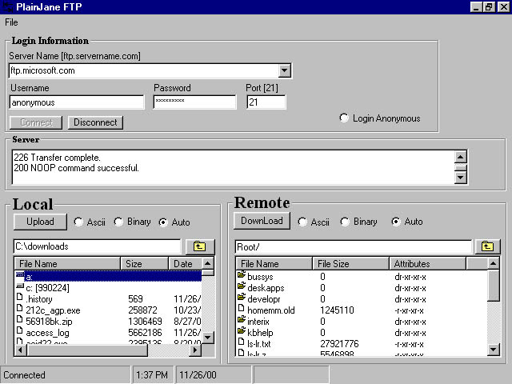



## PlainJane FTP

### Description

This is the project source code for a plain and simple FTP proggy that demonstrates the functionality of FTPx control. Simple and slick.
 
### More Info
 
Run or compile using VB6

             |
---                |---
**Submitted On**   |2000-11-26 13:38:58
**By**             |[Daniel W Ankrom](https://github.com/Planet-Source-Code/PSCIndex/blob/master/ByAuthor/daniel-w-ankrom.md)
**Level**          |Intermediate
**User Rating**    |4.8 (43 globes from 9 users)
**Compatibility**  |VB 6\.0
**Category**       |[Internet/ HTML](https://github.com/Planet-Source-Code/PSCIndex/blob/master/ByCategory/internet-html__1-34.md)
**World**          |[Visual Basic](https://github.com/Planet-Source-Code/PSCIndex/blob/master/ByWorld/visual-basic.md)
**Archive File**   |[CODE\_UPLOAD1208811262000\.zip](https://github.com/Planet-Source-Code/daniel-w-ankrom-plainjane-ftp__1-13131/archive/master.zip)

